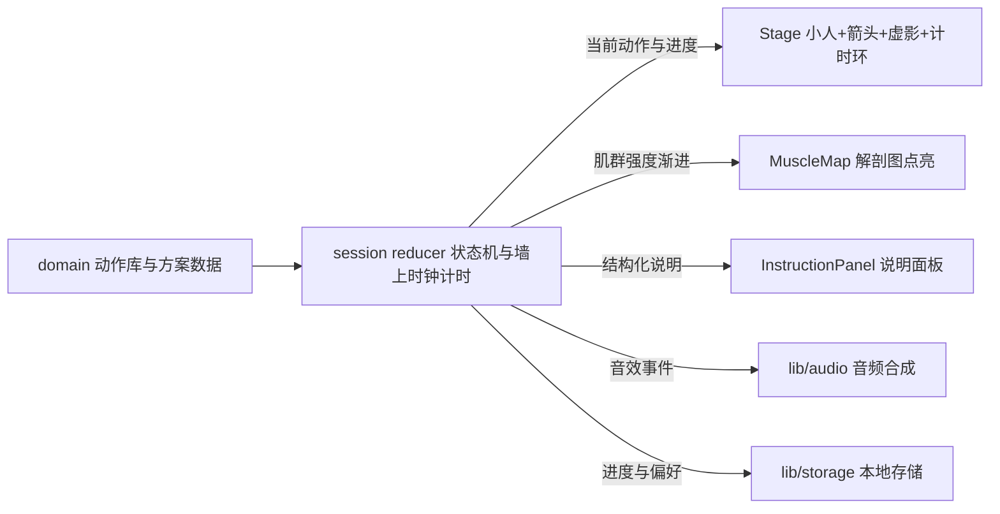

# 每日拉伸 · 多方案锻炼网页 — 项目计划

> 本文档为已确认的项目设计与实施计划，作为开发与后续维护的依据。
> 参考项目：[anubhavitis/stretch-daily](https://github.com/anubhavitis/stretch-daily)（[线上版](https://anubavitis.github.io/stretch-daily/)）
> 部署目标：GitHub Pages（仓库名 `exercises`，访问子路径 `/exercises/`）
> 计划确认日期：2026-09-14

## 1. 产品概述

一个个人锻炼与拉伸引导网页：纯静态、可直接托管于 GitHub Pages，桌面端与手机端均可流畅访问。整体交互与视觉高度参考 stretch-daily（计时引导、解剖肌肉图点亮、明暗双主题、极简工具感），核心差异为支持多套动作方案切换，并将动作示意做得更直观易懂。

## 2. 核心功能

- **多方案管理**：内置 4 套预置方案——久坐办公拉伸、肩颈专项、晨间唤醒、睡前放松；入口为方案选择屏（卡片式），会话中也可快速切换方案；全部动作数据独立存放，用户可自行增删修改
- **引导式会话**：每个动作默认 30 秒，到时自动进入下一个；双侧动作自动先左后右换边并给出提示；支持暂停、跳转上一/下一动作；桌面端支持空格键开始/暂停、左右方向键切换，移动端支持左右滑动切换
- **动作展示增强（核心改进）**：更大更清晰的动画示意小人，叠加动作方向箭头与半透明起始姿势虚影，一眼可判断动作方向与幅度；每个动作配结构化文字说明——准备姿势 → 动作要领 → 应感受到的部位；动作名称中英对照
- **肌肉点亮图**：保留前/后视图解剖人体图，随保持进度按强度由浅入深点亮目标肌群，鼠标悬停/点按显示肌群中文名称；同一份负荷数据驱动小图与说明面板
- **辅助能力**：明/暗双主题、音效提示（半程滴答、结束铃声、换边提示，可静音）、可选定时提醒（20/30/45/60 分钟）、当日进度记忆（次日自动重置）、最近使用方案记忆
- **免责声明**：页脚保留"非医疗建议，疼痛时应停止并咨询专业人士"

视觉上呈现"温暖纸感 + 解剖图解工具风"的现代极简界面：桌面端双栏布局（动画舞台为主视觉），移动端单列纵向滚动 + 吸底控制条。

## 3. 技术栈（与参考项目 stretch-daily 对齐）

- **构建**：Vite 5 + React 18 + TypeScript（strict 模式）
- **样式**：纯手写 CSS（CSS 自定义属性实现明暗双主题），不引入 UI 框架/样式库——对齐参考项目"无框架纯 CSS"取向，产物轻量（用户已确认）
- **运行时依赖**：仅 `react` / `react-dom` / `body-muscles`（SVG 解剖人体图，Apache-2.0，与参考项目同款；集成方式以 npm 包实际 API 为准）
- **图标**：`lucide-react`（线性小图标），备选 `react-icons`
- **音频**：Web Audio API 振荡器合成音效（滴答/铃声/换边/完成），无音频资源文件
- **持久化**：localStorage（版本化 schema）
- **包管理**：npm（参考项目用 pnpm 10 + Node 22，个人项目简化为 npm）
- **部署**：GitHub Actions（checkout → setup-node → npm ci → typecheck → build → upload-pages-artifact → deploy-pages），Vite `base` 设为 `/exercises/`（仓库名子路径）

## 4. 实现思路

1. **数据驱动架构**（继承参考项目"肌肉负荷是数据"的决策，并扩展到动作与方案）：
   - 动作 = 数据：每个动作声明双语名称、姿势关键帧（各关节角度）、方向箭头锚点、结构化说明、肌群负荷（0-10 分）
   - 方案 = 动作的有序引用 + 元信息；4 套方案共享统一动作库（约 25+ 个动作）
   - 用户增删动作/方案只需编辑 `src/domain` 下的数据文件，无需改动组件
2. **参数化 SVG 小人**替代参考项目的"每动作手写 CSS 动画"：
   - Figure 组件按基础姿态（坐/站/跪/卧）渲染关节分组的 SVG 骨架，每个关节组以枢轴为原点 rotate
   - 动画 = CSS transition 在 start/end 两帧角度间过渡（1.2s ease-in-out 进入拉伸姿势后保持，叠加细微呼吸感）；起始虚影 = 静态半透明起始帧；方向箭头 = 语义锚点（关节名 + 方向向量）渲染的 SVG 箭头覆盖层
   - 双侧动作通过 `scaleX(-1)` 镜像复用同一份数据
   - **取舍理由**：25+ 动作逐个手写 CSS keyframes 不可维护；参数化后新增动作只写数据。体积仍远小于图片方案
3. **会话状态机**（继承"会话是 reducer"决策）：开始/暂停/恢复/换边/推进/跳转/切方案全部为 reducer 中的显式状态转换；**计时基于墙上时钟 deadline（`Date.now()`）而非累加 tick**，后台标签页恢复自动重同步不漂移
4. **肌肉点亮**：保持进度 0→1 映射为声明强度的 30%→100% 渐进点亮（对齐参考项目"渐升而非突变"行为），前/后视图共用同一负荷数据

### 性能与可靠性

- 计时单一 interval（约 250ms）驱动；计时环/进度条通过 CSS 自定义属性 + ref 直接写 style，避免每 tick 触发全树重渲染
- 小人动画仅用 transform rotate（GPU 合成层），肌肉点亮仅 fill/opacity 过渡，无 layout 抖动
- AudioContext 在首次用户手势后初始化（iOS 兼容）；音效可全局静音
- localStorage schema 带 version 字段，解析失败静默回退默认值；当日进度按日期比对、次日自动重置
- 移动端：viewport-fit=cover + env(safe-area-inset-bottom) 吸底控制条；触控目标 ≥44px；滑动切换用原生 touch 事件 + 位移阈值，不引入手势库
- 不做的事（YAGNI）：账号/云端同步、客户端路由、SSR、测试框架——保持静态轻量，与参考项目一致（CI 仅类型检查），正确性靠类型约束 + 浏览器可视化验证

## 5. 架构设计

分层与参考项目一致并扩展：domain（数据）→ session（状态机）→ components（视图）→ lib（副作用：音频/存储/提醒）。



## 6. 目录结构

```
exercises/
├── .github/workflows/
│   └── deploy.yml                      # [NEW] Pages 自动部署：npm ci → typecheck → build → deploy-pages
├── docs/
│   └── PLAN.md                         # 本文档
├── index.html                          # [NEW] 入口：viewport(含 viewport-fit=cover)、字体引入、theme-color
├── package.json                        # [NEW] 依赖与脚本 dev/build/preview/typecheck
├── tsconfig.json                       # [NEW] TypeScript strict 配置
├── vite.config.ts                      # [NEW] React 插件；base '/exercises/' 适配项目页子路径
├── README.md                           # [MODIFY] 本地运行、自定义动作/方案指南、开启 Pages(Source 选 GitHub Actions)步骤
└── src/
    ├── main.tsx                        # [NEW] 挂载入口
    ├── App.tsx                         # [NEW] 视图切换：方案选择屏 ↔ 练习屏；主题与偏好初始化
    ├── domain/
    │   ├── types.ts                    # [NEW] LocalizedText/Pose/ArrowSpec/Exercise/Routine 数据契约
    │   ├── figures.ts                  # [NEW] 坐/站/跪/卧四种基础姿态的骨架坐标与关节枢轴定义
    │   ├── muscles.ts                  # [NEW] body-muscles 肌群 id → 中文名称映射(斜方肌、肩胛提肌、腘绳肌等)
    │   ├── exercises/
    │   │   ├── neck.ts                 # [NEW] 颈部动作数据(双语名/结构化说明/姿势/箭头/肌群负荷)
    │   │   ├── shoulders.ts            # [NEW] 肩部动作数据
    │   │   ├── torso.ts                # [NEW] 躯干/腰背动作数据
    │   │   └── lowerBody.ts            # [NEW] 髋/腿动作数据
    │   └── routines.ts                 # [NEW] 4 套方案：久坐办公/肩颈专项/晨间唤醒/睡前放松(引用动作库)
    ├── session/
    │   ├── reducer.ts                  # [NEW] 会话状态机：idle/holding/paused/switching/done 显式转换
    │   ├── timer.ts                    # [NEW] 墙上时钟计时：deadline 计算、visibilitychange 重同步
    │   └── useSession.ts               # [NEW] 会话 Hook：封装 dispatch+计时+音效触发+派生进度
    ├── components/
    │   ├── RoutinePicker.tsx           # [NEW] 方案选择屏：卡片网格+最近使用+免责声明
    │   ├── Header.tsx                  # [NEW] 顶栏：返回/方案名/整体进度、主题切换、静音、提醒设置
    │   ├── Stage.tsx                   # [NEW] 舞台：小人+箭头+虚影+动作名+左右侧徽章+环形倒计时
    │   ├── Figure.tsx                  # [NEW] 参数化 SVG 小人：按 Pose 驱动关节组旋转，支持镜像
    │   ├── InstructionPanel.tsx        # [NEW] 结构化说明：准备姿势/动作要领/应感受到+目标肌群标签
    │   ├── MuscleMap.tsx               # [NEW] body-muscles 前后视图 Tab+进度驱动点亮+中文标签
    │   ├── Thumbnails.tsx              # [NEW] 动作序号带：完成/当前/待做三态，点击跳转
    │   └── Controls.tsx                # [NEW] 播放控制条：上一/暂停/下一；键盘与滑动手势
    ├── lib/
    │   ├── audio.ts                    # [NEW] Web Audio 合成音效：滴答/铃声/换边/完成
    │   ├── storage.ts                  # [NEW] localStorage 封装：版本化 schema、进度、偏好
    │   └── reminders.ts                # [NEW] 定时提醒：20/30/45/60 分钟可选
    └── styles/
        ├── tokens.css                  # [NEW] 明暗主题 CSS 自定义属性(颜色/字号/间距/动效时长)
        ├── base.css                    # [NEW] 重置与全局基础样式、字体加载
        ├── picker.css                  # [NEW] 方案选择屏样式(卡片网格、响应式)
        ├── session.css                 # [NEW] 练习屏布局(桌面双栏/平板/移动单列、吸底控制)
        ├── figure.css                  # [NEW] 关节动画、虚影、箭头、计时环、prefers-reduced-motion
        └── components.css              # [NEW] 说明面板/肌肉图/缩略带等组件样式
```

## 7. 核心数据契约

动作库/方案/姿势关键帧为多模块依赖的基础契约，需精确定义：

```typescript
// src/domain/types.ts
export interface LocalizedText { zh: string; en: string }

/** 关节角度(度)，相对中性姿态，缺省为 0 */
export interface Pose {
  torso?: number; neck?: number; hip?: number;
  armL: { shoulder: number; elbow: number };
  armR: { shoulder: number; elbow: number };
  legL: { hip: number; knee: number };
  legR: { hip: number; knee: number };
}

/** 方向箭头：锚定关节名 + 方向向量，渲染时换算为 SVG 坐标 */
export interface ArrowSpec { anchor: string; dx: number; dy: number; label?: string }

/** id 为 body-muscles 肌群标识，intensity 0-10 */
export interface MuscleLoad { id: string; intensity: number }

export interface Exercise {
  id: string;
  name: LocalizedText;                            // 中英对照
  position: 'seated' | 'standing' | 'kneeling' | 'supine';
  sides: 'none' | 'both';                         // 双侧动作自动先左后右
  duration: number;                               // 秒，默认 30
  instruction: { setup: string; action: string; feel: string };
  muscles: MuscleLoad[];
  pose: { start: Pose; end: Pose };               // 起止姿势，驱动动画与虚影
  arrows: ArrowSpec[];
}

export interface Routine {
  id: string;
  name: LocalizedText;
  scene: LocalizedText;                           // 适用场景标签
  description: string;
  exerciseIds: string[];                          // 引用动作库，有序组合
}
```

## 8. 实施要点

- GitHub Pages 部署需一次性手动操作：仓库 Settings → Pages → Source 选择 "GitHub Actions"，此步骤写入 README
- SPA 单屏切换（无客户端路由），无 404 兜底需求；base 固定 `/exercises/`，本地 dev 与 preview 均可用
- 切换方案时若当前会话已有进度，弹轻量确认避免误触丢失进度
- 视觉与交互细节可对照参考项目线上版本 https://anubavitis.github.io/stretch-daily/ 校准
- prefers-reduced-motion：关闭关节动画与虚影，直接定格结束姿势，仅保留必要状态变化

## 9. 设计规范

**风格关键词**：现代极简 · 温暖纸感 · 解剖图解工具风 · 草木绿主色 · 双语排印 · 明暗双主题

延续参考项目克制、工具感的气质：暖白纸感底色 + 草木绿主色 + 珊瑚色肌群点亮，中英双语排印层级分明；全局明暗双主题，微动效（关节旋转、点亮渐变、卡片悬浮）克制而有生命感。

**字体**：思源黑体（Noto Sans SC）+ Karla

| 层级 | 字号 | 字重 |
|---|---|---|
| 标题 | 30px | 600 |
| 副标题 | 18px | 500 |
| 正文 | 15px | 400 |

**色彩**：

| 类别 | 色值 |
|---|---|
| 主色（草木绿） | `#2F6E5F` / `#3A8570` / `#1F4E43` |
| 背景（亮色） | `#FAF8F4` / `#FFFFFF` |
| 背景（暗色） | `#1A1815` / `#232019` |
| 文字 | `#292524` / `#78716C` / `#EDE9E3` |
| 功能色 | 琥珀 `#D97706` · 珊瑚 `#E76F51`（肌群点亮）· 错误 `#C0392B` · 辅助绿 `#4C9A82` |

## 10. 屏幕规划（2 屏）

### 屏 1 · 方案选择屏

- **顶部栏**：应用名"每日拉伸 · Stretch Daily"、明暗主题切换、静音开关，细底边线分隔
- **方案卡片区**：桌面 2×2、移动单列；每卡含方案名（中文大标 + 英文小标）、场景标签、预计时长与动作数、一句话简介；hover 微抬升 + 主色描边，点击进入练习屏
- **最近使用条**：显示上次方案与当日完成状态，提供"继续上次"快捷按钮
- **底部**：免责声明小字（非医疗建议）与仓库链接

### 屏 2 · 练习屏（核心）

- **顶栏**：返回按钮、当前方案名 + 分段式整体进度条、提醒设置入口
- **舞台区（视觉核心）**：大幅动画小人（关节旋转进入拉伸姿势），叠加方向箭头与半透明起始虚影；上方为动作名中英对照与"左侧/右侧"徽章；环形倒计时包裹秒数
- **说明面板**：三段结构化卡片——准备姿势 / 动作要领 / 应感受到，各配线性小图标；底部为目标肌群中文标签 chips
- **肌肉图区**：前/后视图 Tab 切换，解剖图随保持进度由浅入深点亮；悬停/点按显示肌群中文名称
- **缩略图带**：当前方案动作序号条（已完成勾选 / 当前高亮 / 待做灰显），点击跳转
- **底部控制条**：上一动作 / 播放暂停 / 下一动作三个大圆钮；桌面显示快捷键提示，移动端固定吸底（安全区适配）+ 左右滑动切换

## 11. 响应式断点

- **≥1024px**：双栏——左侧舞台 + 控制为主视觉（约 60% 宽），右侧说明面板 + 肌肉图纵排
- **768–1023px**：单栏，舞台置顶，说明与肌肉图两列并排
- **<768px**：单列纵向滚动（顶栏 → 舞台 → 说明 → 缩略带 → 肌肉图可折叠），底部吸底控制条；触控目标 ≥44px

## 12. 交互与动效

- 小人进场：关节旋转 1.2s ease-in-out 进入结束姿势并保持细微呼吸感，箭头随进场淡入
- 肌肉点亮：fill/opacity 800ms 渐进过渡，强度随倒计时递增
- 换边提示：侧别徽章翻转 + 短促提示音；整套完成时勾选微弹 + 钟声轻庆祝
- prefers-reduced-motion：动画定格为结束姿势，仅保留必要状态变化

## 13. 开发约束

- Vite 5、TypeScript 5 作为开发依赖；样式全部手写 CSS（CSS 自定义属性 + 语义化类名），不引入 UI 框架/样式库（用户已确认，覆盖环境默认工具链）
- 图标库：lucide-react（开发依赖，线性小图标）
- 单文件不超过 300 行；第三方库直接以包名导入，本地文件使用准确的相对路径
- 需导出供其他文件使用的类型/接口/类必须加 `export`
- 按钮一律使用 `<button>`，输入一律使用 `<input>`；交互状态（hover/active/focus）与光标样式完整
- vite 开发服务器配置 `server.host: '0.0.0.0'`、`server.allowedHosts: true`

## 14. 验证与打磨

- **视觉打磨**（impeccable skill）：方案选择屏与练习屏的排版层级、间距节奏、明暗主题一致性、微动效与响应式表现，确保"温暖纸感 × 解剖图解工具风"完整落地
- **可视化验证**（agent-browser skill）：本地 dev server 以桌面（1440px）与移动（390px）断点截图，检查布局、小人动画、方向箭头与虚影、肌肉点亮、主题切换与控制交互，双断点无回归后交付

## 15. 任务拆解

| # | 任务 | 依赖 |
|---|---|---|
| 1 | 初始化 Vite+React18+TS 工程：目录骨架、明暗主题 tokens、全局基础样式、GitHub Actions 部署工作流（base /exercises/） | — |
| 2 | 建立数据层：types 数据契约、figures 关节枢轴定义、muscles 中文映射、动作库分文件（颈/肩/躯干/下肢）、4 套方案组合 | 1 |
| 3 | 实现会话状态机：墙上时钟计时、换边/推进/跳转/切方案显式转换、Web Audio 音效合成、localStorage 持久化与定时提醒 | 2 |
| 4 | 实现核心组件：参数化 SVG 小人（关节旋转动画+起始虚影+方向箭头）、body-muscles 肌肉点亮图（强度渐进+中文标签）、结构化说明面板 | 2 |
| 5 | 组装方案选择屏与练习屏（顶栏/舞台/说明/肌肉图/缩略带/控制条），完成桌面双栏与移动单列响应式及键盘、滑动交互 | 3、4 |
| 6 | 视觉打磨与微动效，桌面/移动断点截图验证布局、主题与动画 | 5 |
| 7 | 更新 README（运行/自定义方案/开启 Pages 指南），验证生产构建，提交并部署 GitHub Pages | 6 |
